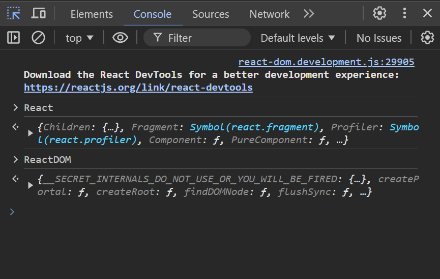
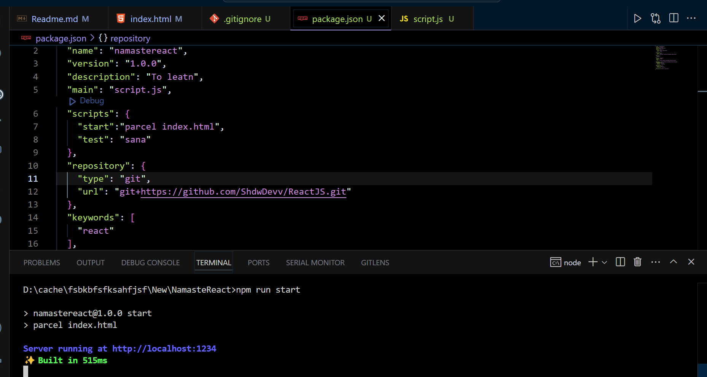

# React JS
* Normal HTML
```html
<!DOCTYPE html>
<html lang="en">
<head>
    <meta charset="UTF-8">
    <meta name="viewport" content="width=device-width, initial-scale=1.0">
    <title>Namaste React</title>
</head>
<body>
    <div id="root">
        <h1>Hello All</h1>
    </div>
    <script>
        const heading = document.createElement("h1");
        heading.innerHTML = "Hello Everyone";
        const rootElement = document.getElementById("root");
        rootElement.appendChild(heading);
    </script>
</body>
</html>
```
## Shortest Program of React
```html 
<!DOCTYPE html>
<html lang="en">
<head>
    <meta charset="UTF-8">
    <meta name="viewport" content="width=device-width, initial-scale=1.0">
    <title>Namaste React</title>
</head>
<body>
    <div id="root"></div>
    <script crossorigin src="https://unpkg.com/react@18/umd/react.development.js"></script>
    <script crossorigin src="https://unpkg.com/react-dom@18/umd/react-dom.development.js"></script>
</body>
</html>
```
* with this cdn links we installed React

## To Tell Hello all in React
```html
<!DOCTYPE html>
<html lang="en">
<head>
    <meta charset="UTF-8">
    <meta name="viewport" content="width=device-width, initial-scale=1.0">
    <title>Namaste React</title>
</head>
<body>
    <div id="root">Not Rendered </div>
    <script crossorigin src="https://unpkg.com/react@18/umd/react.development.js"></script>
    <script crossorigin src="https://unpkg.com/react-dom@18/umd/react-dom.development.js"></script>
    <script>
        const header = React.createElement("h1",{id:"title",className :"sana"},"Hello All");
        console.log(header); // It will print the object
        const root = ReactDOM.createRoot(document.getElementById("root"));
        root.render(header);
    </script>
</body>
</html>
```
## Dev Dependency  vs Global Dependency
* Downloading Parcel as a DevDependency makes sense because it's a tool you need during development to bundle your code, but it's not needed when your app is running in production. Parcel helps you build your project efficiently, but once the project is deployed, Parcel isn’t required anymore.
* On the other hand, downloading React as a Global Dependency means you want to have it available system-wide for use in any project without installing it for each one. However, React is typically installed as a local dependency (in your project folder) because the version of React should stay consistent with each specific project to avoid compatibility issues. So, installing React globally isn't common practice for most developers unless you have a specific reason to use it across many projects in a particular way.

## Foundation of React
* we are writing npx parcel index.html for many times , So to reduce this

* To add remove console
* https://www.npmjs.com/package/babel-plugin-transform-remove-console/v/6.1.17
* https://babeljs.io/docs/babel-plugin-transform-remove-console/
```shell
npm install babel-plugin-transform-remove-console --save-dev
```

## Learned Structure
```js
import React from "react";
import ReactDOM from "react-dom/client";
const header1 = React.createElement("h1",{id:"title",key:"h1"},"Header 1 from Parcel");
const header2 = React.createElement("h2",{id:"sub-title1",key:"h2"},"Header 2 from Parcel");
const header3 = React.createElement("h3",{id:"sub-title2",key:"h3"},"Header 3 from Parcel");
const header4 = React.createElement("h4",{id:"sub-title3",key:"h4"},"Header 4 from Parcel");
const header5 = React.createElement("h5",{id:"sub-title4",key:"h5"},"Header 5 from Parcel");
const header6 = React.createElement("h6",{id:"sub-title5",key:"h6"},"Header 6 from Parcel");
const container = React.createElement("div",{id:"container"},[header1,header2,header3,header4,header5,header6]);    
const root = ReactDOM.createRoot(document.getElementById("root"));
root.render(container);
```
* JSX - HTML like Syntax
```html
<!DOCTYPE html>
<html lang="en">
<head>
    <meta charset="UTF-8">
    <meta name="viewport" content="width=device-width, initial-scale=1.0">
    <title>Namaste React</title>
</head>
<body>
    <div id="root">Not Rendered </div>
    <div>
        <h1>Arshth</h1>
        <ul>
            <li>About</li>
            <li>Support</li>
            <li>Contact</li>
        </ul>
    </div>
    <script type="module" src="./script.js"></script>
</body>
</html>
```
```js
import React from "react";
import ReactDOM from "react-dom/client";
const h1 = React.createElement("h1",{},"Arshath");
const li1 = React.createElement("li",{},"About");
const li2 = React.createElement("li",{},"Support");
const li3 = React.createElement("li",{},"Contact");
const ul = React.createElement("ul",{},[li1,li2,li3]);
const container2 = React.createElement("div",{},[h1,ul]);
const root = ReactDOM.createRoot(document.getElementById("root"));
root.render(container2);
```